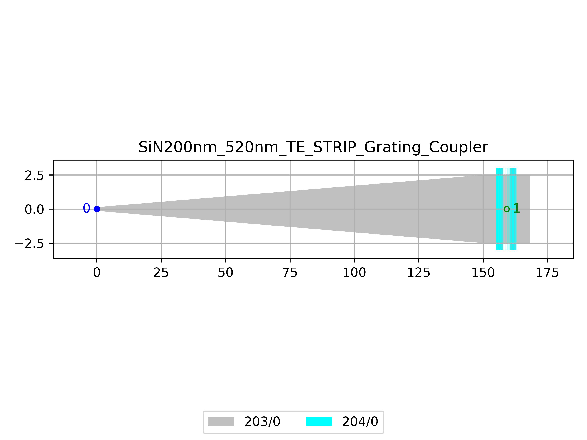

# SiN200nm_520nm_TE_STRIP_Grating_Coupler
| Field | Value |
|:---------|:-----|
| Authors|CORNERSTONE (CORNERSTONE) Dr Thalia Dominguez Bucio (University of Southampton)|
| Last Updated | 04/07/2025 |
| SHA256 Hash | `875ff577d755bd8e5fdc19855735c1b2019237b5` |
| Raw GDS | [Download from GitHub](https://github.com/cornerstone-uos/cornerstone-community/tree/main/SiN_200nm/components/SiN200nm_520nm_TE_STRIP_Grating_Coupler.gds) |

