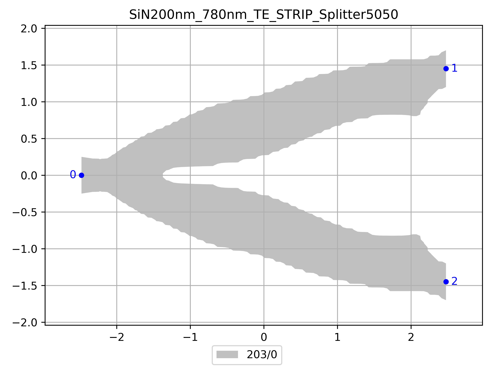

# SiN200nm_780nm_TE_STRIP_Splitter5050
| Field | Value |
|:---------|:-----|
| Authors|Skandan Chandrasekar (None)|
| Last Updated | 29/03/2026 |
| SHA256 Hash | `3e6d19066b3b8a4b9bb4ada60cd2eec080ff6b6a` |
| Raw GDS | [Download from GitHub](https://github.com/cornerstone-uos/cornerstone-community/tree/main/SiN_200nm/components/SiN200nm_780nm_TE_STRIP_Splitter5050.gds) |

