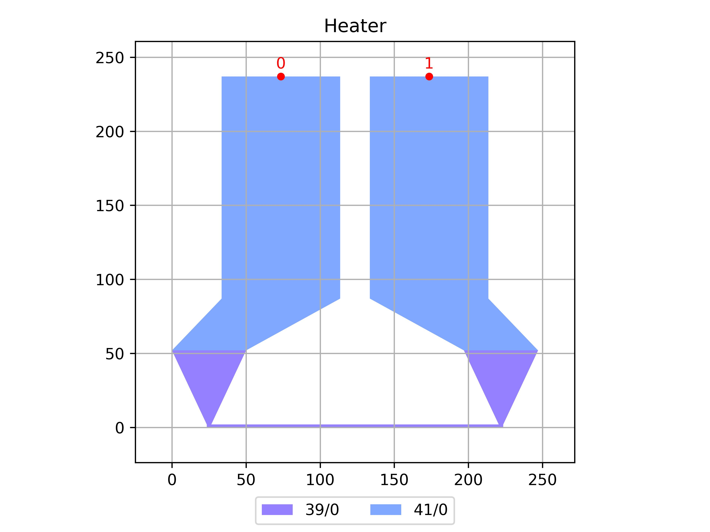

# Heater
| Field | Value |
|:---------|:-----|
| Authors|CORNERSTONE (CORNERSTONE)|
| Last Updated | 28/07/2025 |
| SHA256 Hash | `04472353dac5a63761cb674b4cf31ab5c8bf519c` |
| Raw GDS | [Download from GitHub](https://github.com/cornerstone-uos/cornerstone-community/tree/main/SiN_300nm/components/Heater.gds) |

