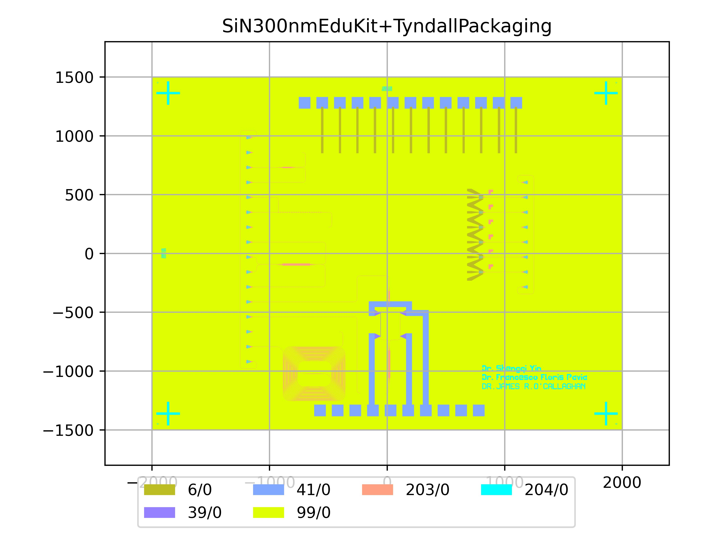

# SiN300nmEduKit+TyndallPackaging
| Field | Value |
|:---------|:-----|
| Authors|Dr James O'Callaghan (Tyndall National Institute) Dr Shengqi Yin (CORNERSTONE) Dr Francesco Floris (University of Pavia)|
| Last Updated | 18/09/2025 |
| SHA256 Hash | `5bda2956afc66b9f8032f6bf70666d6cacd09aa6` |
| Raw GDS | [Download from GitHub](https://github.com/cornerstone-uos/cornerstone-community/tree/main/SiN_300nm/components/SiN300nmEduKit%2BTyndallPackaging.gds) |

