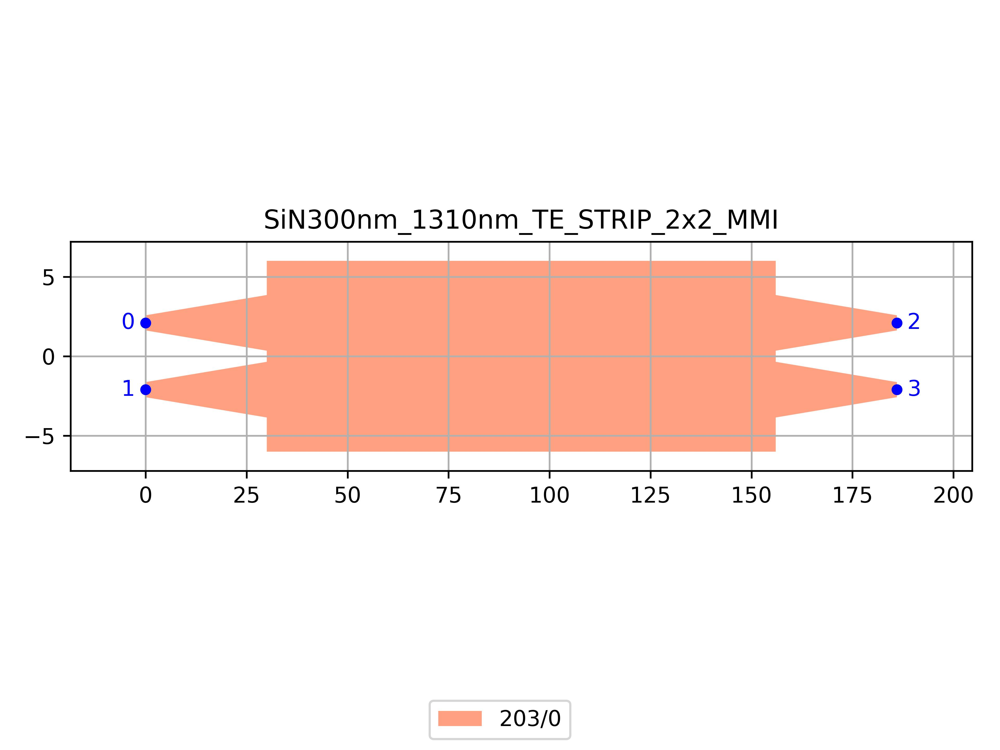

# SiN300nm_1310nm_TE_STRIP_2x2_MMI
| Field | Value |
|:---------|:-----|
| Authors|CORNERSTONE (CORNERSTONE)|
| Last Updated | 28/07/2025 |
| SHA256 Hash | `f13bd7cee2a16d69ed43812fb096cbf2e53767fb` |
| Raw GDS | [Download from GitHub](https://github.com/cornerstone-uos/cornerstone-community/tree/main/SiN_300nm/components/SiN300nm_1310nm_TE_STRIP_2x2_MMI.gds) |

