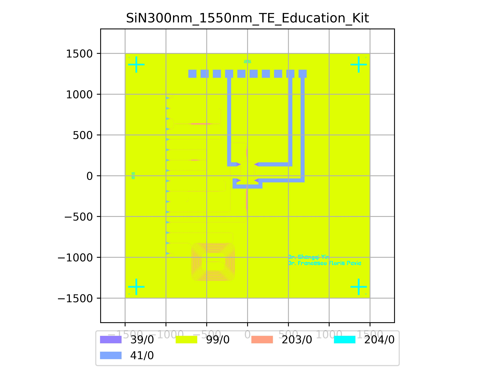

# SiN300nm_1550nm_TE_Education_Kit
| Field | Value |
|:---------|:-----|
| Authors|Dr Shengqi Yin (CORNERSTONE) Dr Francesco Floris (University of Pavia)|
| Last Updated | 14/07/2025 |
| SHA256 Hash | `191800972ac13dbd4693c0cc264966d6dfee28d0` |
| Comments | Manual for the educational kit can be found in [docs/_static/CORNERSTONE_Educational_Kit_Manual.pdf](../../_static/CORNERSTONE_Educational_Kit_Manual.pdf) |
| Raw GDS | [Download from GitHub](https://github.com/cornerstone-uos/cornerstone-community/tree/main/SiN_300nm/ready-made/SiN300nm_1550nm_TE_Education_Kit.gds) |

