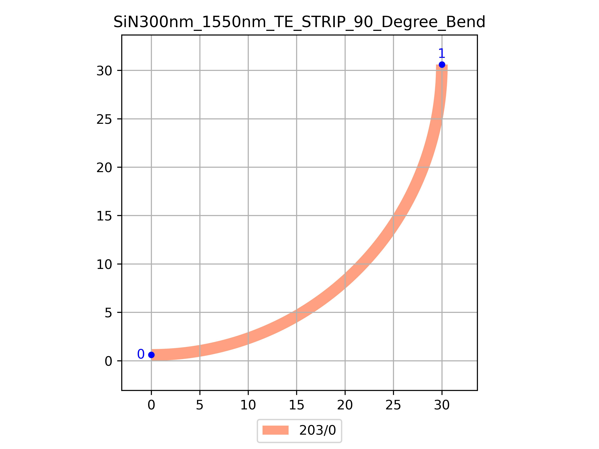

# SiN300nm_1550nm_TE_STRIP_90_Degree_Bend
| Field | Value |
|:---------|:-----|
| Authors|CORNERSTONE (CORNERSTONE)|
| Last Updated | 28/07/2025 |
| SHA256 Hash | `61ab6727f249e56361c34e87195a26e0096a9e46` |
| Raw GDS | [Download from GitHub](https://github.com/cornerstone-uos/cornerstone-community/tree/main/SiN_300nm/components/SiN300nm_1550nm_TE_STRIP_90_Degree_Bend.gds) |

