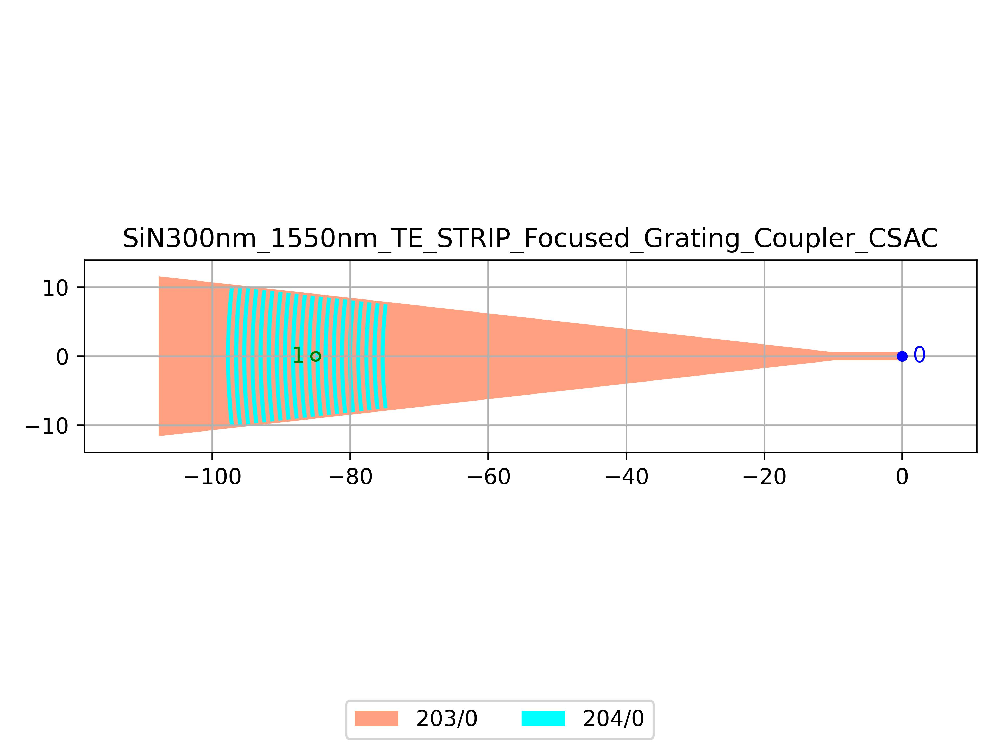

# SiN300nm_1550nm_TE_STRIP_Focused_Grating_Coupler_CSAC
| Field | Value |
|:---------|:-----|
| Authors|Thomas Parker (CSA Catapult)|
| Last Updated | 26/09/2025 |
| SHA256 Hash | `4787396ef2480cb31c117c236804d4f083dbf5c4` |
| Raw GDS | [Download from GitHub](https://github.com/cornerstone-uos/cornerstone-community/tree/main/SiN_300nm/components/SiN300nm_1550nm_TE_STRIP_Focused_Grating_Coupler_CSAC.gds) |

