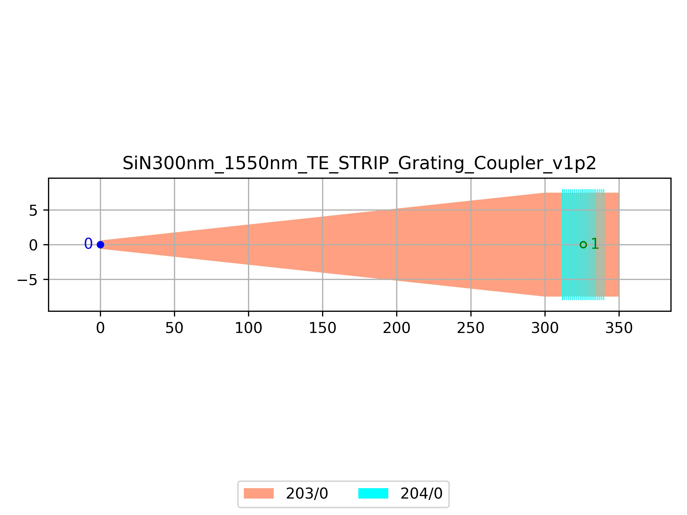

# SiN300nm_1550nm_TE_STRIP_Grating_Coupler_v1p2
| Field | Value |
|:---------|:-----|
| Authors|CORNERSTONE (CORNERSTONE)|
| Last Updated | 28/07/2025 |
| SHA256 Hash | `d0c0fae45fb7b70ca2d296f1ddd084ac6989e9c5` |
| Raw GDS | [Download from GitHub](https://github.com/cornerstone-uos/cornerstone-community/tree/main/SiN_300nm/components/SiN300nm_1550nm_TE_STRIP_Grating_Coupler_v1p2.gds) |

