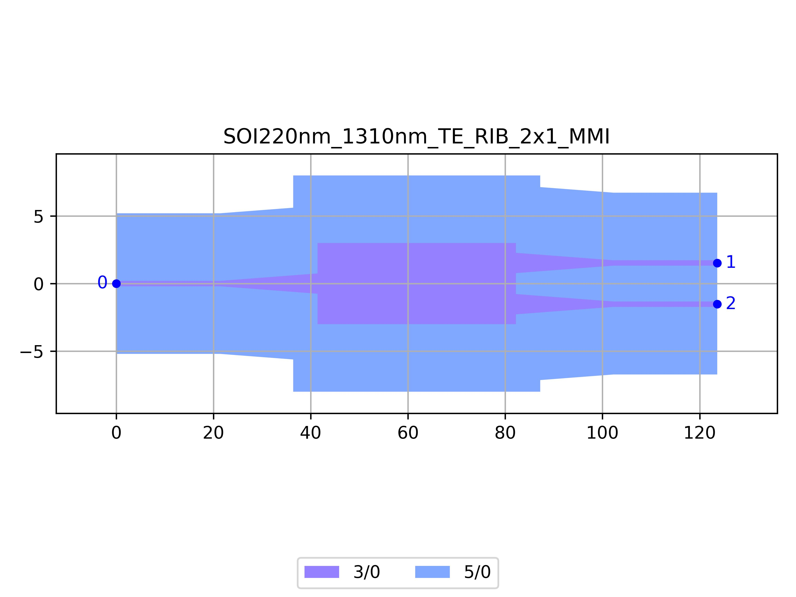

# SOI220nm_1310nm_TE_RIB_2x1_MMI
| Field | Value |
|:---------|:-----|
| Authors|CORNERSTONE (CORNERSTONE)|
| Last Updated | 28/07/2025 |
| SHA256 Hash | `96c2fa30a734e0e30675f7f3e1ec921b1c76e06b` |
| Raw GDS | [Download from GitHub](https://github.com/cornerstone-uos/cornerstone-community/tree/main/Si_220nm_active/components/SOI220nm_1310nm_TE_RIB_2x1_MMI.gds) |

