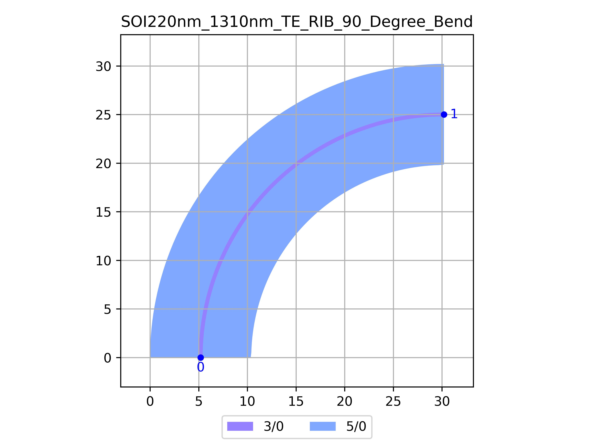

# SOI220nm_1310nm_TE_RIB_90_Degree_Bend
| Field | Value |
|:---------|:-----|
| Authors|CORNERSTONE (CORNERSTONE)|
| Last Updated | 28/07/2025 |
| SHA256 Hash | `d65c9be69eeb01e9e323f7d8ec8eeb61cef1ceda` |
| Raw GDS | [Download from GitHub](https://github.com/cornerstone-uos/cornerstone-community/tree/main/Si_220nm_active/components/SOI220nm_1310nm_TE_RIB_90_Degree_Bend.gds) |

