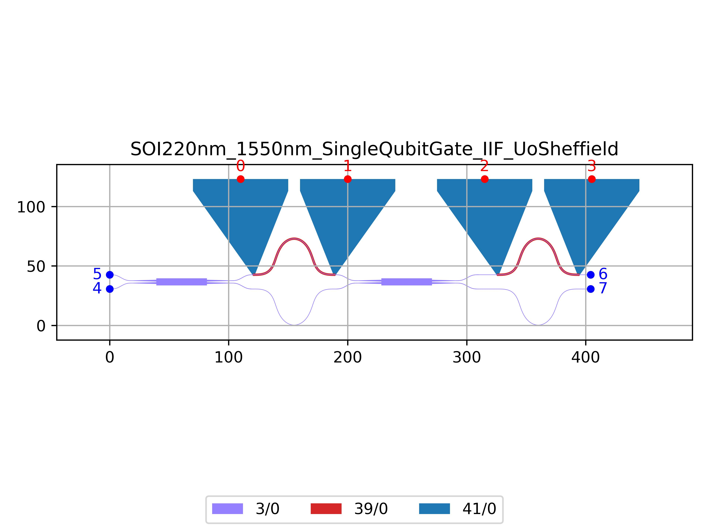

# SOI220nm_1550nm_SingleQubitGate_IIF_UoSheffield
| Field | Value |
|:---------|:-----|
| Authors|Dr Imad Faruque (University of Sheffield)|
| Last Updated | 01/10/2025 |
| SHA256 Hash | `446916fc16604ffd29e8f8ca506808addde1ba19` |
| Raw GDS | [Download from GitHub](https://github.com/cornerstone-uos/cornerstone-community/tree/main/Si_220nm_active/components/SOI220nm_1550nm_SingleQubitGate_IIF_UoSheffield.gds) |

