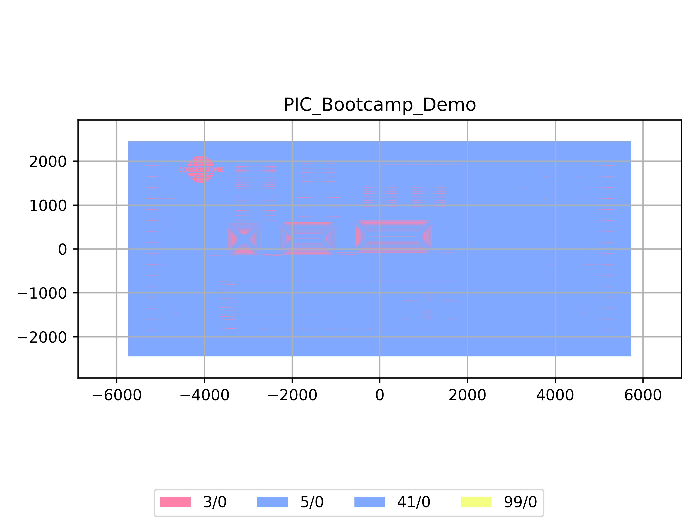

# PIC_Bootcamp_Demo
| Field | Value |
|:---------|:-----|
| Authors|CORNERSTONE (CORNERSTONE)|
| Last Updated | 13/02/2026 |
| SHA256 Hash | `0b0ccf61d31793b92419a1c0ae58e9bfa434c48f` |
| Comments | While there is substantial overlap between the component designs compared to the Educational Kit, PIC Bootcamp Demo chip only contains one etch depth (120nm), and one metal layer (Ti/Al) for quick fabrication. Manual for the educational kit can be found in [docs/_static/PIC_Bootcamp_Manual.pdf](../../_static/PIC_Bootcamp_Manual.pdf) |
| Raw GDS | [Download from GitHub](https://github.com/cornerstone-uos/cornerstone-community/tree/main/Si_220nm_passive/ready-made/PIC_Bootcamp_Demo.gds) |

