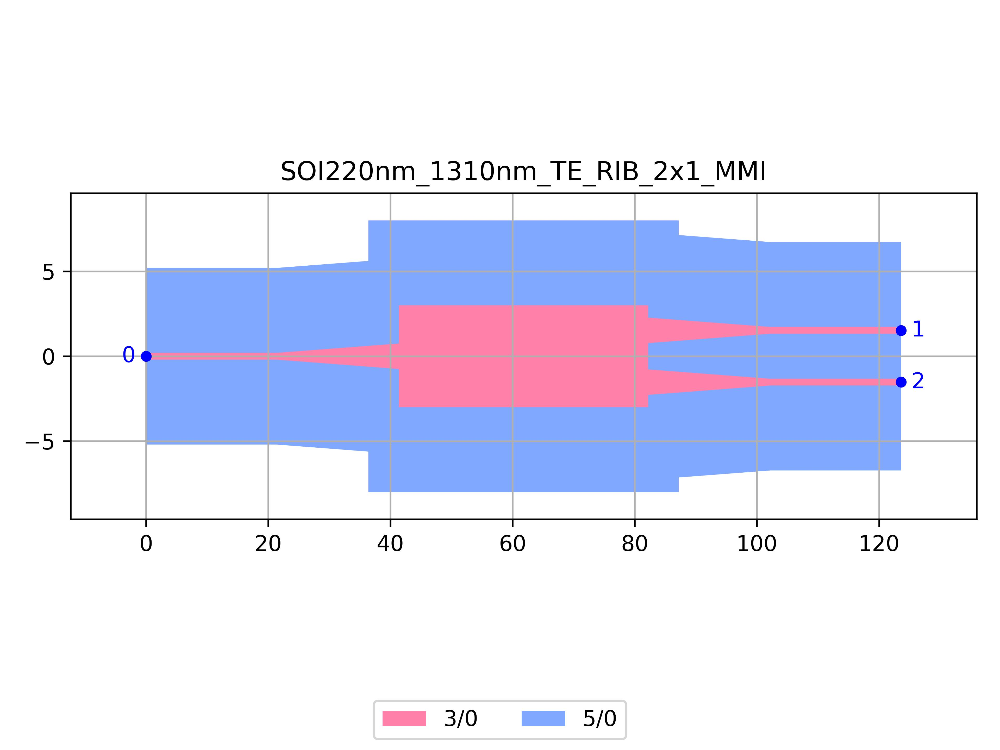

# SOI220nm_1310nm_TE_RIB_2x1_MMI
| Field | Value |
|:---------|:-----|
| Authors|CORNERSTONE (CORNERSTONE)|
| Last Updated | 20/07/2025 |
| SHA256 Hash | `746bfb798dd679d40b26be6987045f8a8be93f5a` |
| Raw GDS | [Download from GitHub](https://github.com/cornerstone-uos/cornerstone-community/tree/main/Si_220nm_passive/components/SOI220nm_1310nm_TE_RIB_2x1_MMI.gds) |

