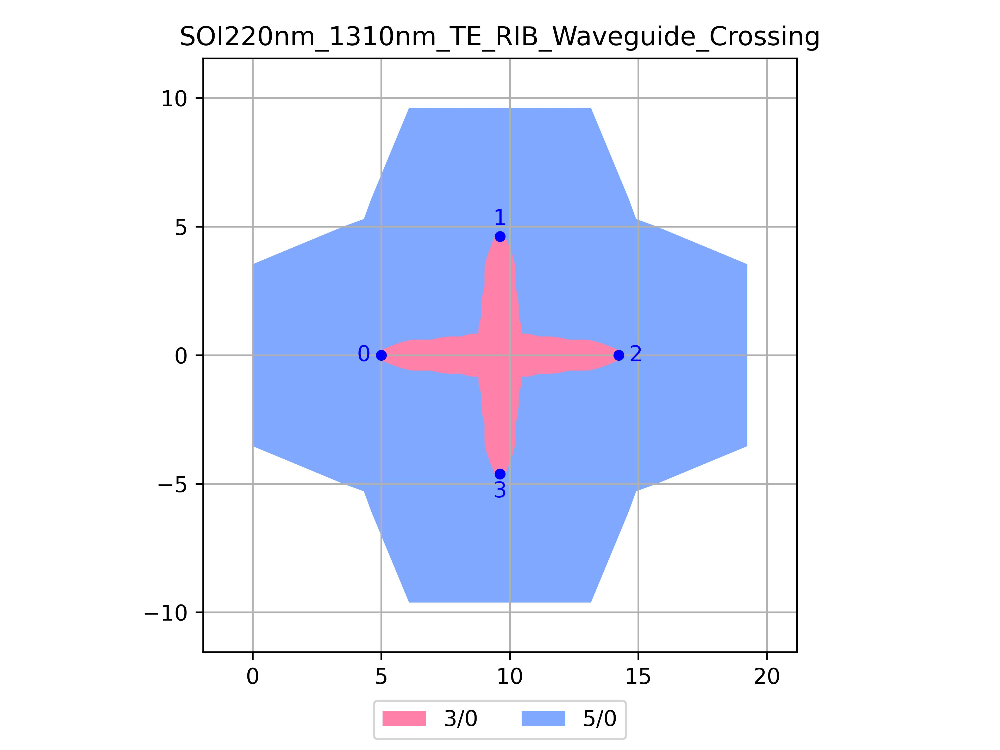

# SOI220nm_1310nm_TE_RIB_Waveguide_Crossing
| Field | Value |
|:---------|:-----|
| Authors|CORNERSTONE (CORNERSTONE)|
| Last Updated | 20/07/2025 |
| SHA256 Hash | `87900bd1739f1471938219aa37be70f92220f8b3` |
| Raw GDS | [Download from GitHub](https://github.com/cornerstone-uos/cornerstone-community/tree/main/Si_220nm_passive/components/SOI220nm_1310nm_TE_RIB_Waveguide_Crossing.gds) |

