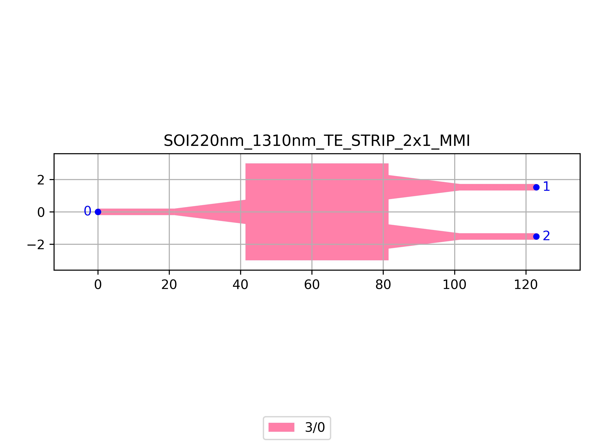

# SOI220nm_1310nm_TE_STRIP_2x1_MMI
| Field | Value |
|:---------|:-----|
| Authors|CORNERSTONE (CORNERSTONE)|
| Last Updated | 20/07/2025 |
| SHA256 Hash | `08159b1d9734440038daf6f18d9d1c7621e8b6ac` |
| Raw GDS | [Download from GitHub](https://github.com/cornerstone-uos/cornerstone-community/tree/main/Si_220nm_passive/components/SOI220nm_1310nm_TE_STRIP_2x1_MMI.gds) |

