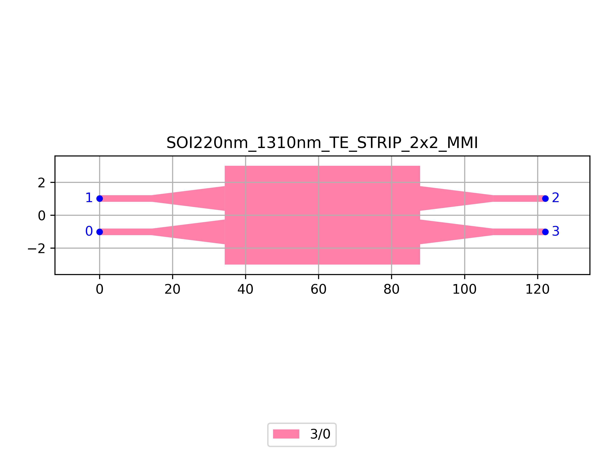

# SOI220nm_1310nm_TE_STRIP_2x2_MMI
| Field | Value |
|:---------|:-----|
| Authors|CORNERSTONE (CORNERSTONE)|
| Last Updated | 20/07/2025 |
| SHA256 Hash | `3da3f1d1402e81983455397f623e513c003c38e1` |
| Raw GDS | [Download from GitHub](https://github.com/cornerstone-uos/cornerstone-community/tree/main/Si_220nm_passive/components/SOI220nm_1310nm_TE_STRIP_2x2_MMI.gds) |

