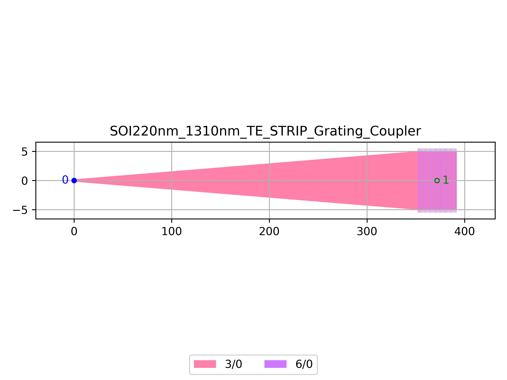

# SOI220nm_1310nm_TE_STRIP_Grating_Coupler
| Field | Value |
|:---------|:-----|
| Authors|CORNERSTONE (CORNERSTONE)|
| Last Updated | 20/07/2025 |
| SHA256 Hash | `0b98e1319f45ee219a89e7a17f455a8bee989b47` |
| Raw GDS | [Download from GitHub](https://github.com/cornerstone-uos/cornerstone-community/tree/main/Si_220nm_passive/components/SOI220nm_1310nm_TE_STRIP_Grating_Coupler.gds) |

