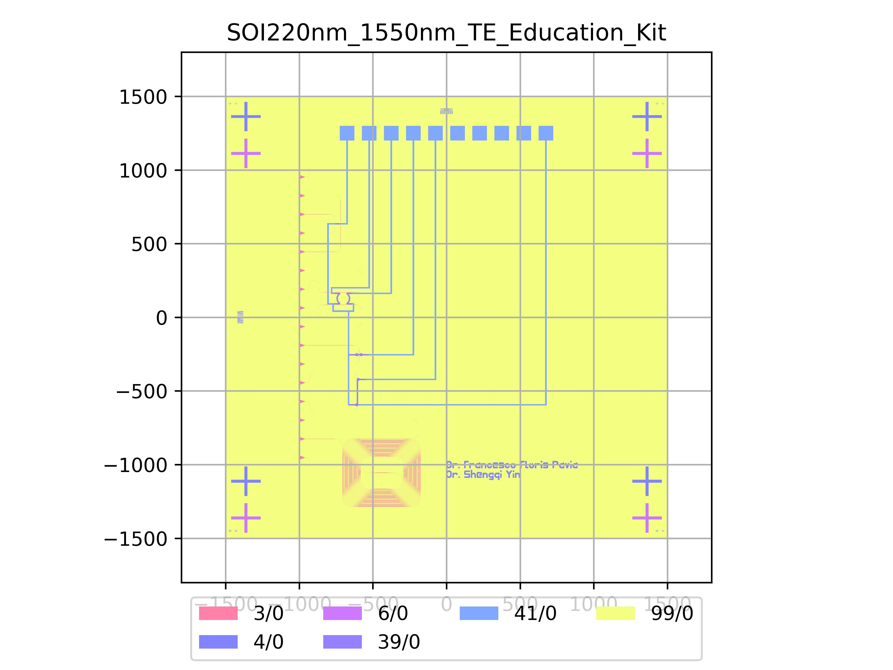

# SOI220nm_1550nm_TE_Education_Kit
| Field | Value |
|:---------|:-----|
| Authors|Dr Shengqi Yin (CORNERSTONE) Dr Francesco Floris (University of Pavia)|
| Last Updated | 25/07/2025 |
| SHA256 Hash | `f8b07e3a1d3ab75f77b989a4d9830431080a8228` |
| Comments | Manual for the educational kit can be found in [docs/_static/CORNERSTONE_Educational_Kit_Manual.pdf](../../_static/CORNERSTONE_Educational_Kit_Manual.pdf) |
| Raw GDS | [Download from GitHub](https://github.com/cornerstone-uos/cornerstone-community/tree/main/Si_220nm_passive/components/SOI220nm_1550nm_TE_Education_Kit.gds) |

