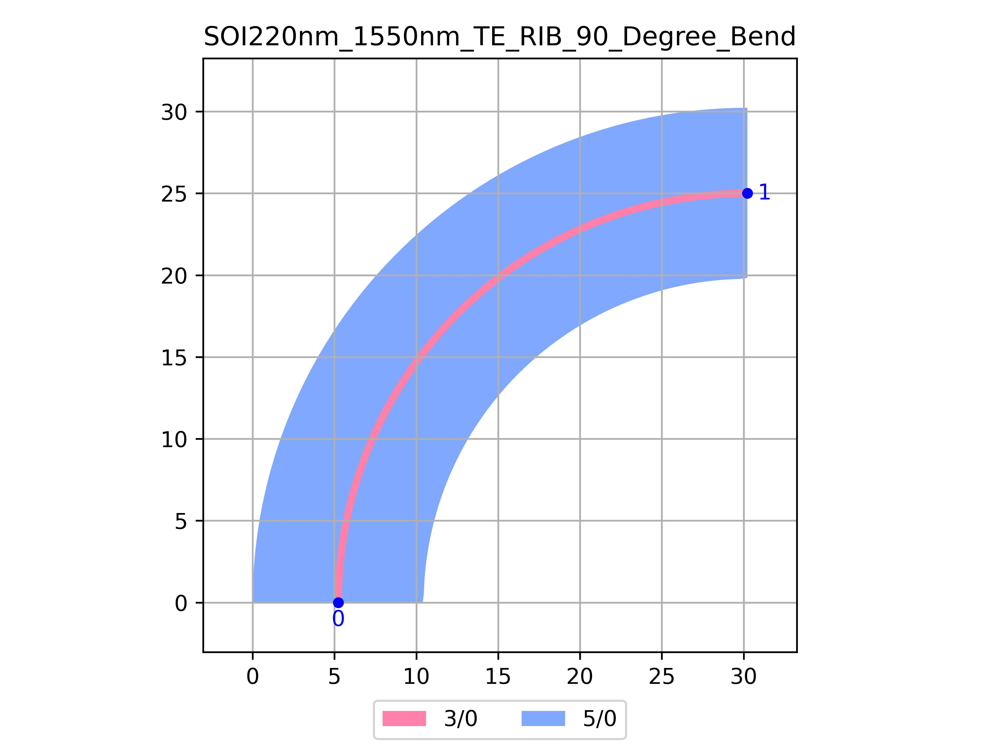

# SOI220nm_1550nm_TE_RIB_90_Degree_Bend
| Field | Value |
|:---------|:-----|
| Authors|CORNERSTONE (CORNERSTONE)|
| Last Updated | 20/07/2025 |
| SHA256 Hash | `624a8f69960dac6831d05d97af492bd2af1227bb` |
| Raw GDS | [Download from GitHub](https://github.com/cornerstone-uos/cornerstone-community/tree/main/Si_220nm_passive/components/SOI220nm_1550nm_TE_RIB_90_Degree_Bend.gds) |

