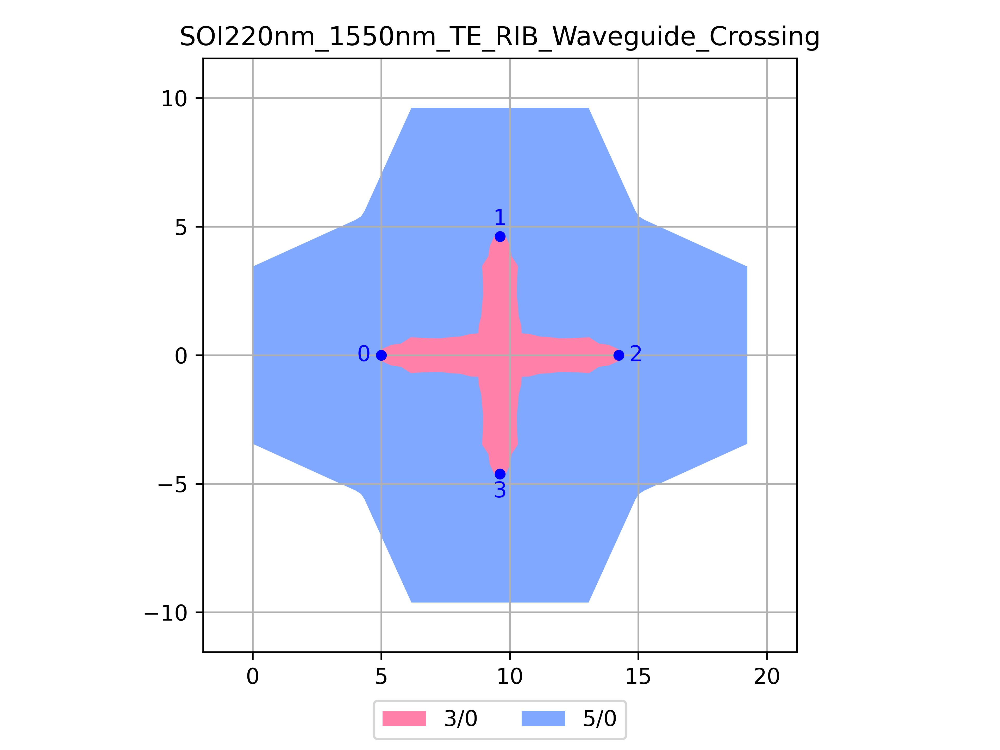

# SOI220nm_1550nm_TE_RIB_Waveguide_Crossing
| Field | Value |
|:---------|:-----|
| Authors|CORNERSTONE (CORNERSTONE)|
| Last Updated | 20/07/2025 |
| SHA256 Hash | `2823c8b10d0d12e55c61d3140eabc92c9d698a86` |
| Raw GDS | [Download from GitHub](https://github.com/cornerstone-uos/cornerstone-community/tree/main/Si_220nm_passive/components/SOI220nm_1550nm_TE_RIB_Waveguide_Crossing.gds) |

