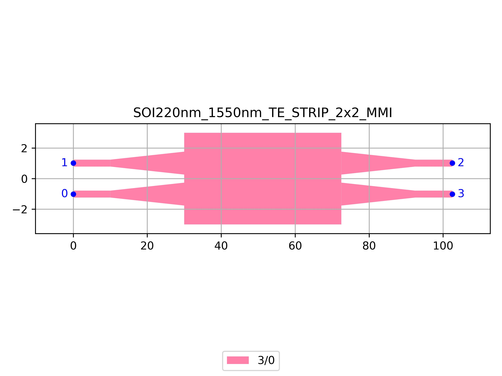

# SOI220nm_1550nm_TE_STRIP_2x2_MMI
| Field | Value |
|:---------|:-----|
| Authors|CORNERSTONE (CORNERSTONE)|
| Last Updated | 20/07/2025 |
| SHA256 Hash | `5139612c640c8166e2c5d032872d76c78c295770` |
| Raw GDS | [Download from GitHub](https://github.com/cornerstone-uos/cornerstone-community/tree/main/Si_220nm_passive/components/SOI220nm_1550nm_TE_STRIP_2x2_MMI.gds) |

