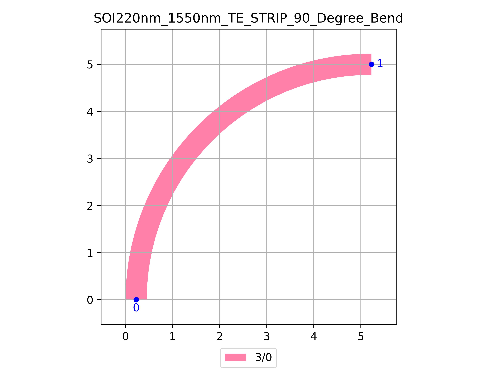

# SOI220nm_1550nm_TE_STRIP_90_Degree_Bend
| Field | Value |
|:---------|:-----|
| Authors|CORNERSTONE (CORNERSTONE)|
| Last Updated | 20/07/2025 |
| SHA256 Hash | `5fc2f359928ef426f8f20be4c4fabb6c17659d8d` |
| Raw GDS | [Download from GitHub](https://github.com/cornerstone-uos/cornerstone-community/tree/main/Si_220nm_passive/components/SOI220nm_1550nm_TE_STRIP_90_Degree_Bend.gds) |

