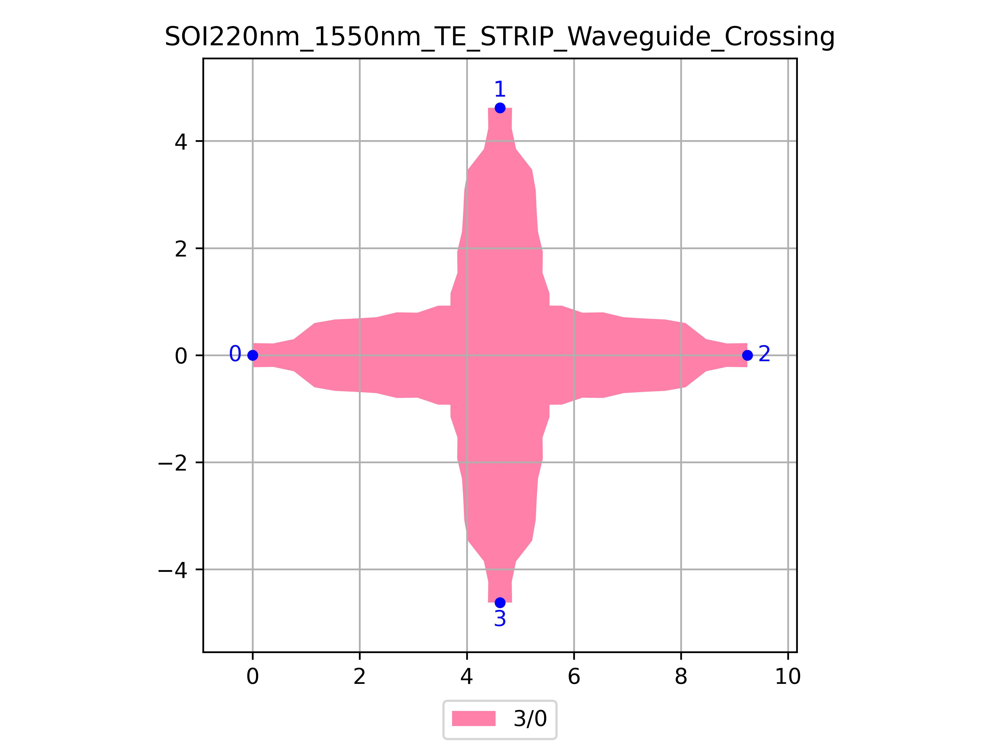

# SOI220nm_1550nm_TE_STRIP_Waveguide_Crossing
| Field | Value |
|:---------|:-----|
| Authors|CORNERSTONE (CORNERSTONE)|
| Last Updated | 20/07/2025 |
| SHA256 Hash | `68f04d6cbefd5ec42b93198a34c45e43e2ce27a7` |
| Raw GDS | [Download from GitHub](https://github.com/cornerstone-uos/cornerstone-community/tree/main/Si_220nm_passive/components/SOI220nm_1550nm_TE_STRIP_Waveguide_Crossing.gds) |

