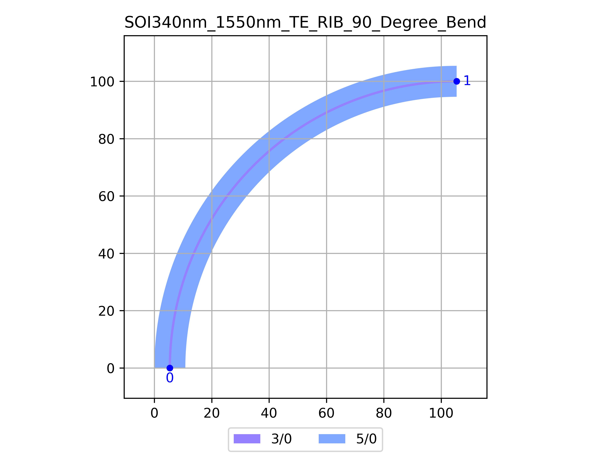

# SOI340nm_1550nm_TE_RIB_90_Degree_Bend
| Field | Value |
|:---------|:-----|
| Authors|CORNERSTONE (CORNERSTONE)|
| Last Updated | 20/07/2025 |
| SHA256 Hash | `98d7f328a3d948413870068e56a5dee3bf41f934` |
| Raw GDS | [Download from GitHub](https://github.com/cornerstone-uos/cornerstone-community/tree/main/Si_340nm/components/SOI340nm_1550nm_TE_RIB_90_Degree_Bend.gds) |

