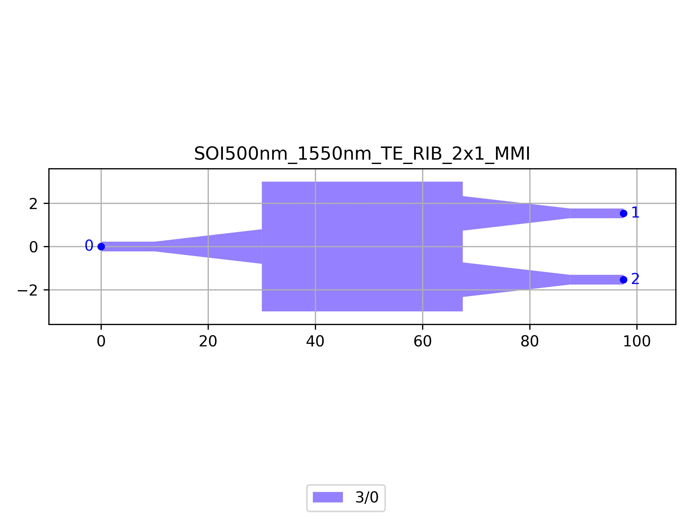

# SOI500nm_1550nm_TE_RIB_2x1_MMI
| Field | Value |
|:---------|:-----|
| Authors|CORNERSTONE (CORNERSTONE)|
| Last Updated | 21/07/2025 |
| SHA256 Hash | `08aecc06f2ace7955e9e71afff6ed8eea7d5f73a` |
| Raw GDS | [Download from GitHub](https://github.com/cornerstone-uos/cornerstone-community/tree/main/Si_500nm/components/SOI500nm_1550nm_TE_RIB_2x1_MMI.gds) |

