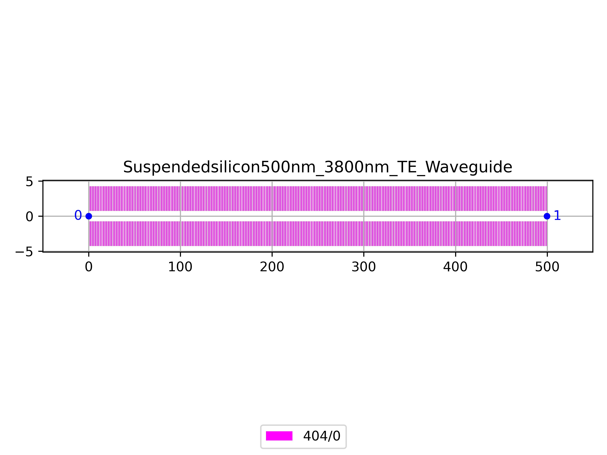

# Suspendedsilicon500nm_3800nm_TE_Waveguide
| Field | Value |
|:---------|:-----|
| Authors|CORNERSTONE (CORNERSTONE)|
| Last Updated | 01/07/2025 |
| SHA256 Hash | `2e7faf937b2c95b2b5a448197725e6481bcb630e` |
| Raw GDS | [Download from GitHub](https://github.com/cornerstone-uos/cornerstone-community/tree/main/Si_sus_bias/components/Suspendedsilicon500nm_3800nm_TE_Waveguide.gds) |

