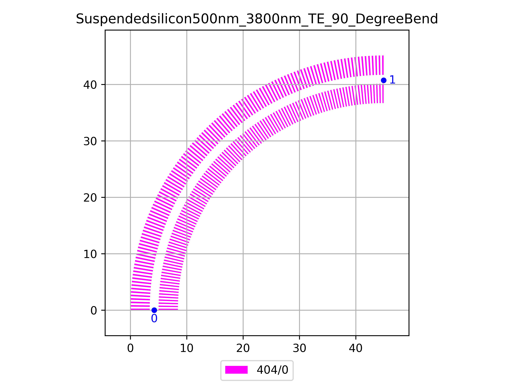

# Suspendedsilicon500nm_3800nm_TE_90_DegreeBend
| Field | Value |
|:---------|:-----|
| Authors|CORNERSTONE (CORNERSTONE)|
| Last Updated | 01/07/2025 |
| SHA256 Hash | `20899c6ba506fc0a73c9e856e80be31722020c98` |
| Raw GDS | [Download from GitHub](https://github.com/cornerstone-uos/cornerstone-community/tree/main/Si_sus_not_bias/components/Suspendedsilicon500nm_3800nm_TE_90_DegreeBend.gds) |

