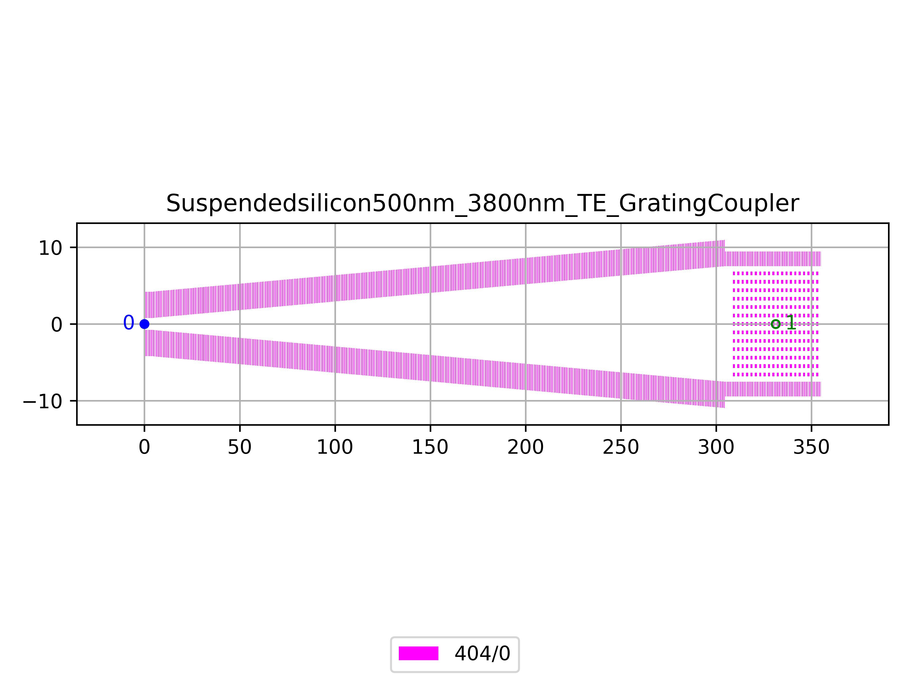

# Suspendedsilicon500nm_3800nm_TE_GratingCoupler
| Field | Value |
|:---------|:-----|
| Authors|CORNERSTONE (CORNERSTONE)|
| Last Updated | 10/07/2025 |
| SHA256 Hash | `8f4fb1873bc20740a6ff265c3a458b3a05ad21a5` |
| Raw GDS | [Download from GitHub](https://github.com/cornerstone-uos/cornerstone-community/tree/main/Si_sus_not_bias/components/Suspendedsilicon500nm_3800nm_TE_GratingCoupler.gds) |

