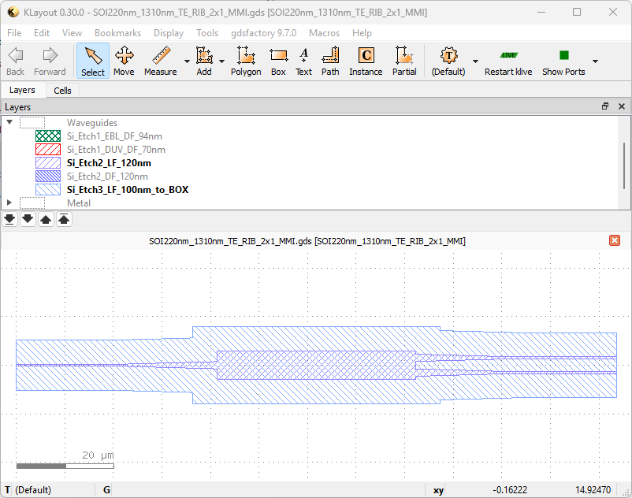
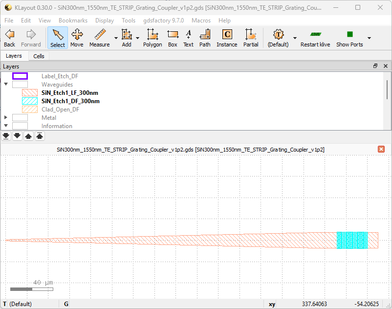

Below is the breakdown of an exemplary YAML file for a component, a 1x2 MMI, which has one input and two output ports, all optical. The original component file can be found [here](../../Si_220nm_active/components/SOI220nm_1310nm_TE_RIB_2x1_MMI.yaml)



First, let's define the name of the file.

``` yaml
name: SOI220nm_1310nm_TE_RIB_2x1_MMI
```

This should be identical to the GDS file name (without the file extension). Continuing with the component type,

``` yaml
component_type: MMI1x2                 
```

`component_type` is not allowed to be arbitrary within the Wavephotonics' YAML format - these are specified in the [allowed list of components](../wp_format/components_list.rst) . Another requirement from Wavephotonics is explicit specification of the modes going through the ports.

``` yaml
modes:                                 
  - mode_numbers:                        
    - 0                                     
    - 0
    polarisation: TE                     
    wavelength: 1310                     
```

Here, we have defined `modes`, which has only one mode entry, TE_00 mode at 1310nm wavelength. When defined globally for the component this way, the `modes` field will be assigned to all the ports of the component. We move on to defining the ports:

``` yaml
ports:                                 
- name: o1                               
  port_type: optical                     
  center:                                 
  - 0                                      
  - 0
  orientation: 180                        
  cross_section: rib_1310nm_TE
- name: o2                                                   
  port_type: optical                        
  center:                                 
  - 123.6
  - 1.52500
  orientation: 0                                        
  cross_section: rib_1310nm_TE         
- name: o3
  port_type: optical
  center:
  - 123.6
  - -1.525
  orientation: 0
  cross_section: rib_1310nm_TE
```

Here, we defined the three ports within this MMI. First port `o1` is the input port, and is facing the -x direction, hence its `orientation` is 180. It has a cross-section `rib_1310nm_TE`, which will be described in `*/cross-sections/cross_sections.yaml` - it will be presented as a cross-section example later on. Ports `o2` and `o3` are outputs, they face +x direction (0 degree orientation), with their centres offset by `1.525 um` from `y=0` line.

Below we demonstrate port-level mode definition within a grating coupler's YAML. The component is a 1D grating coupler for c-band operation in SiN - the original component file can be found [here](../../SiN_300nm/components/SiN300nm_1550nm_TE_STRIP_Grating_Coupler_v1p2.yaml)



``` yaml
name: SiN300nm_1550nm_TE_STRIP_Grating_Coupler_v1p2   
component_type: GratingCoupler1D                      
ports:                                                
  - center:                                            
    - 0.0
    - 0.0
    name: o1                                            
    orientation: 180
    port_type: optical
    cross_section: strip_1550nm_TE                  
    modes:                                              
    - mode_numbers:                                      
      - 0                                                   
      - 0
      polarisation: TE                                      
      wavelength: 1550                                       
```

We defined the first port, an optical port with cross-section `strip_1550nm_TE` and facing -x. It is defined for TE_00 mode at 1550nm: `modes` went a level down in hierarchy to be a field of `ports`. The second port is a vertical port, which requires a different set of fields

``` yaml
ports: # Kept here to display the indentation - this line does not exist in the original file
  - center:                                             
    - 325.81                                              
    - 0
    name: vertical_te                                  
    port_type: vertical_te                             
    orientation: 0.0                                 
    width:  10.0                                  
    coupling_angle_cladding: 13.659
    fibre_modes:                                        
    - fibre_type: SMF-28                                  
      wavelength: 1550                                    
```

- Here, `port_type` is specified as `vertical_te` from the [allowed list of ports](../wp_format/ports_list.rst) .
- For vertical ports, we are allowed to define a `width` instead of a `cross-section` - e. g. `10.0` here.
- Another important parameter is `coupling_angle_cladding` - this is the relative angle of the light travelling within the cladding. This component was designed for a 20 degree fibre angle over SiO2 cladding, hence `coupling_angle_cladding = arcsind(sind(20)*n_air/n_siox) = 13.659`. If the device had been air-clad, `coupling_angle_cladding` would have been set to `20.0`.
- Lastly, we defined `fibre_modes` to specify the possibly different fibres to be used across different settings; i. e. it is possible to use `780HP` for 780nm operation and `SMF-28` for 1550nm operation over the same grating coupler by defining an additional entry to `fibre_modes`, using the fibres listed in the [allowed list of fibres](../wp_format/fibres_list.rst).