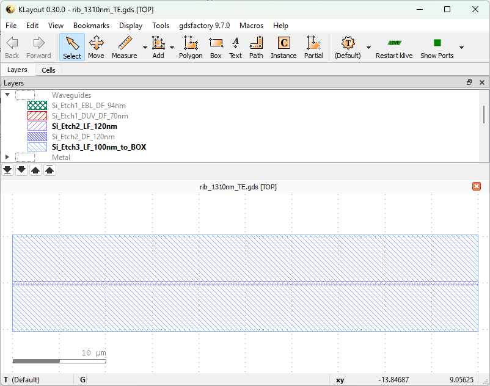
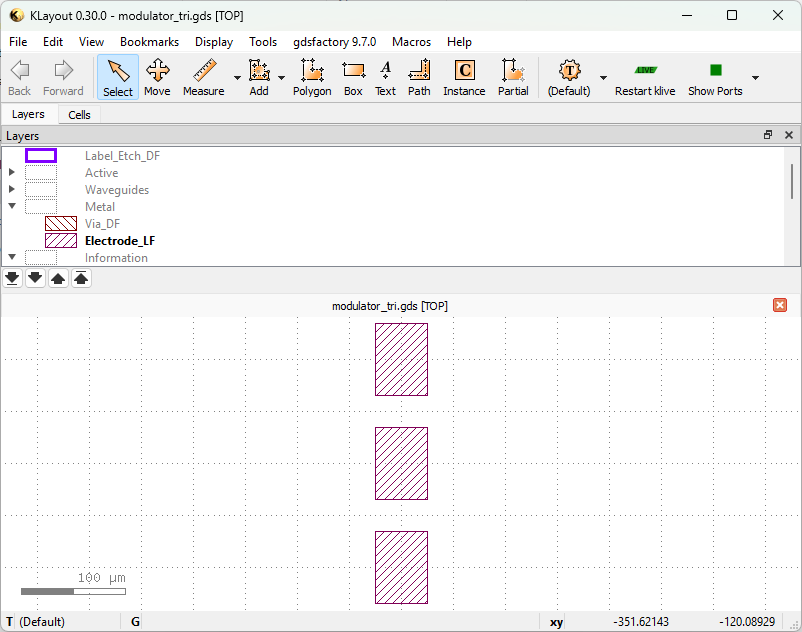

Below is the breakdown of an exemplary YAML file for cross-section definition, for `Si_220nm_active` platform in this case. The original file can be found [here](../../Si_220nm_active/cross-sections/cross_sections.yaml). The described cross-sections also exist as GDS files with identical names within the same folder (see [cross-sections](../../Si_220nm_active/cross-sections/) folder).

First, we start by defining `strip_1310nm_TE`, a strip waveguide cross-section designed to work for TE mode at 1310nm.

``` yaml
- name: strip_1310nm_TE
  xs_type: strip
  width: 0.4
  materials: Si
  minimum_bend_radius: 10
  layers:
  - layer:
    - 3
    - 0
    offset: 0
    width: 0.4
  modes:
  - mode_numbers:
    - 0
    - 0
    polarisation: TE
    wavelength: 1310
  - mode_numbers:
    - 0
    - 0
    polarisation: TM
    wavelength: 1310
```

`xs_type` needs to be chosen from the [allowed list of cross sections](../wp_format/cross_sections_list.rst). We define the total width of the cross-section `width`, the materials and minimum bend radius. The `layers` field involves the geometries (position and width) of the layers that constitute the cross-section. For this strip cross-section, we only have GDS Layer 3/0 (the `layer` entry), 0.4 microns long (`width: 0.4`), sitting at the centre of the cross section (`offset: 0`).

We move on to define `modes`, this will include all the modes that this cross-section supports. A certain cross-section will be able to support across a broad wavelength regime, of course, but we are only interested in the wavelengths that are interesting to simulate (extract the s-parameters for). Usually this boils down to a short spectral range around the design wavelengths of the component set, here the o-band. This cross-section supports a TE and TM mode at 1310nm, hence we define two mode entries for TE_00 and TM_00 at 1310nm.

Moving on to a rib cross-section, we have:



``` yaml
- name: rib_1310nm_TE
  xs_type: rib
  width: 10.4
  materials: Si
  minimum_bend_radius: 25
  layers:
  - layer:
    - 3
    - 0
    offset: 0
    width: 0.4
  - layer:
    - 5
    - 0
    offset: 0
    width: 10.4
  modes:
  - mode_numbers:
    - 0
    - 0
    polarisation: TE
    wavelength: 1310
```

As the rib waveguide is comprised of a narrow rib (layer 3/0, 0.4 microns wide) and a wide slab (defined by the protection layer 5/0, with a total width of 10.4 microns), we will need to define two layer entries. These layers are concentric (`offset` s are 0). Another difference with `strip_1310nm_TE` is the lack of TM mode definition here - `rib_1310nm_TE` simply does not support the TM mode.

Next, we define the remaining optical cross-sections:

``` yaml
- name: strip_1550nm_TE
  xs_type: strip
  width: 0.45
  materials: Si
  minimum_bend_radius: 10
  layers:
  - layer:
    - 3
    - 0
    offset: 0
    width: 0.45
  modes:
  - mode_numbers:
    - 0
    - 0
    polarisation: TE
    wavelength: 1550
  - mode_numbers:
    - 0
    - 0
    polarisation: TM
    wavelength: 1550
- name: rib_1550nm_TE
  xs_type: rib
  width: 10.45
  materials: Si
  minimum_bend_radius: 25
  layers:
  - layer:
    - 3
    - 0
    offset: 0
    width: 0.45
  - layer:
    - 5
    - 0
    offset: 0
    width: 10.45
  modes:
  - mode_numbers:
    - 0
    - 0
    polarisation: TE
    wavelength: 1550
```

We then define the electrical contacts for the heaters (see [Heater](../../Si_220nm_active/components/Heater.gds) component) and the detectors (see [Isolated Detector](../../Si_220nm_active/components/SOI220nm_1550nm_TE_IsolatedDetector.gds) component). For metal layers, we use `minimum_bend_radius: 0`.

``` yaml
- name: dc
  xs_type: dc
  width: 80
  materials: metal1
  minimum_bend_radius: 0
  layers:
  - layer:
    - 13
    - 0
    offset: 0
    width: 80
- name: detector
  xs_type: dc
  width: 100
  materials: metal1
  minimum_bend_radius: 0
  layers:
  - layer:
    - 13
    - 0
    offset: 0
    width: 100
```

Lastly, we define the modulator connections, which are expected to support the modulator for 28 Gb/s operation - hence deeply in the RF regime. RF contact are usually defined together to allow for custom routing options that preserve path differences. We use `xs_type: png` because the port has a `positive - negative - ground` geometry. We also define the three contact regions under the cross-section through setting different offsets - (see [SOI220nm_1310nm_TE_MZI_Modulator](../../Si_220nm_active/components/SOI220nm_1310nm_TE_MZI_Modulator.gds))



``` yaml
- name: modulator_tri
  xs_type: png
  width: 269
  materials: metal1
  minimum_bend_radius: 0
  layers:
  - layer:
    - 13
    - 0
    offset: -100
    width: 69
  - layer:
    - 13
    - 0
    offset: 0
    width: 69
  - layer:
    - 13
    - 0
    offset: 100
    width: 69
```

All of the cross-sections defined here have corresponding GDS files to help with parsing the YAML files. The GDS file for a cross-section should contain a 50 micron-long structure along x-axis, with the profile alongside y-axis is defined by the corresponding cross-section.