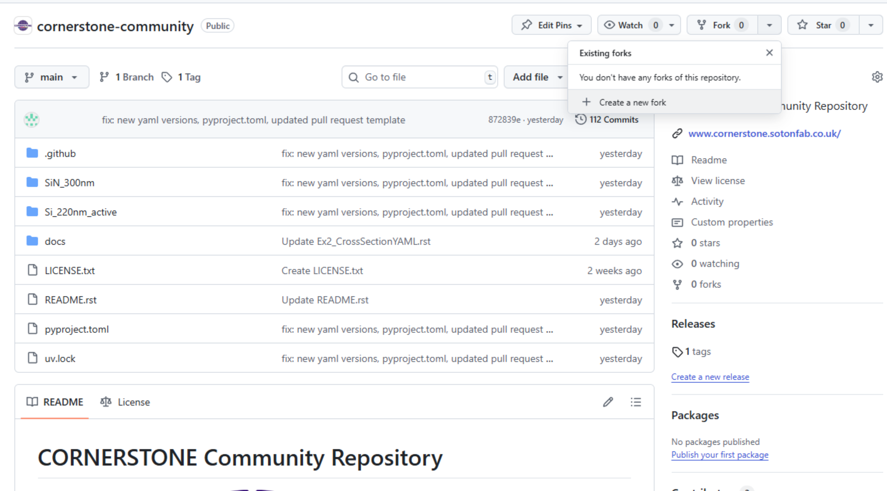
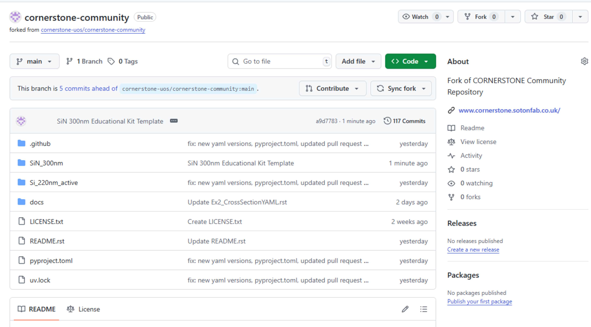
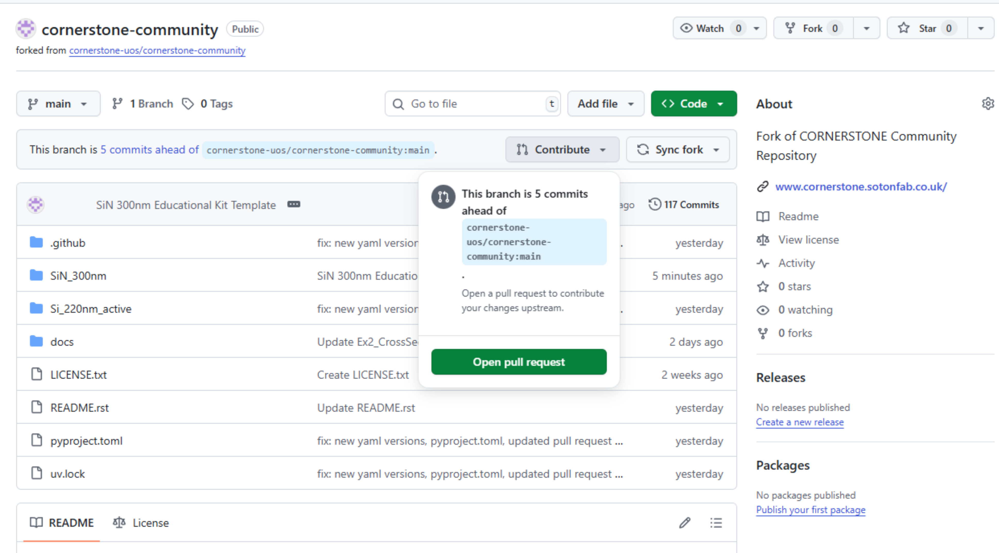

# Guide on forking and submitting a pull request to CORNERSTONE Community Repository

Here, we have a visual guide on the submission process flow within CORNERSTONE Community Repository over the web interface of GitHub.

## 1- Fork the original Repository

Go to the [community repository](https://github.com/cornerstone-uos/cornerstone-community) and "fork" it. Forking allows the user to create a clone of a repository under their own GitHub account, allowing the user to build a personal project based on the source code through version releases without directly modifying the source ([see documentation on GitHub Docs](https://docs.github.com/en/pull-requests/collaborating-with-pull-requests/working-with-forks) for more details).




These will create a personal version of the original source, which holds the diff information between the sourced repository and the fork.


## 2- Create the submission files

For this example submission, we are going to add an educational template kit built on 300nm SiN process. There are three new design files, two of them being standalone cells (`SiN300nm_1550nm_EduKit_DelayLine` and `SiN300nm_1550nm_EduKit_GratingCoupler`) and a composite/derived cell (`SiN300nm_1550nm_EduKit`) that contains these standalone cells, as well as components found in the source repository (such as MMIs, crossings and heaters). All of the GDS files are accompanied by their Component YAMLs.


In line with the [formatting guidelines](../FormattingGuidelines.md), we include the author and ancestry information in the template file, and the author information in the standalone cells. For the referenced cells in the original repository, we provide the hash key of the latest original repository commit that contains the referenced files in the exact shape. The hash key (`872839ed66e5b4b024aa70d65cd2f714ac62f273` in this case) can be copied by accessing the list of commits (visible in the first image, just below `Create a new fork`) in the original repository and copying from the corresponding entry:


``` yaml
# Tail of the Component YAML for the template file 
ancestors:
- name: SiN300nm_1550nm_EduKit_DelayLine
  commit: ReferenceWithinCommit
- name: SiN300nm_1550nm_EduKit_GratingCoupler
  commit: ReferenceWithinCommit
- name: SiN300nm_1550nm_TE_STRIP_Crossing
  commit: 872839ed66e5b4b024aa70d65cd2f714ac62f273
- name: SiN300nm_1550nm_TE_STRIP_2x1_MMI
  commit: 872839ed66e5b4b024aa70d65cd2f714ac62f273
- name: SiN300nm_1550nm_TE_STRIP_2x2_MMI
  commit: 872839ed66e5b4b024aa70d65cd2f714ac62f273
- name: Heater
  commit: 872839ed66e5b4b024aa70d65cd2f714ac62f273

authors: # this field is blanked in the example.
- name: 
  organisation: 
  email: 
- name: 
  organisation: 
  email: 
```

## 3- Upload the files and push to the fork

To upload the files through the browser in GitHub, go to the relevant folder (`SiN_300nm/components` in this case) and select <span class="title-ref">Upload files</span> from the <span class="title-ref">Add files</span> menu. As GitHub Web UI only allows uploads to a single folder at a time, you will need to upload new cross-sections (if they exist) over multiple commits - if you are using Git in your computer, then these can be done in a single commit.


After the upload, you can specify the commit details for your benefit. Subsequently, you can commit directly to your fork's `main`.As there is a pull request template in the Community Repository, the second option will unnecessarily invoke the PR template within your fork. If you are concerned with tidiness of your `main`, you should create a new branch from the fork `main` and commit directly to that branch.


Your fork will look similar to the one below following the commit and push:



## 4- Create a pull request to the Community Repository

After you uploaded all the new/modified files and would like to make a submission, select `Open pull request` from `Contribute`. It is a good idea to sync to the latest version of the Community Repository from `Sync fork` and change the referred commit hash keys in the derived/modified components.



This will create a pull request template with a Markdown-format commit message for the contributor to modify and fill (see the template [here](../../.github/pull_request_template.md))

You can preview the commit message (see below) from the `Preview` button above the edit box:


Click `Create pull request` to start the review process by the CORNERSTONE PDK Team.